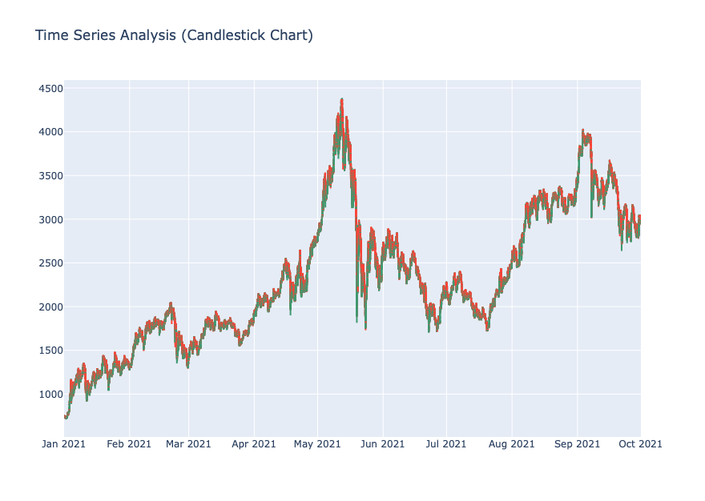
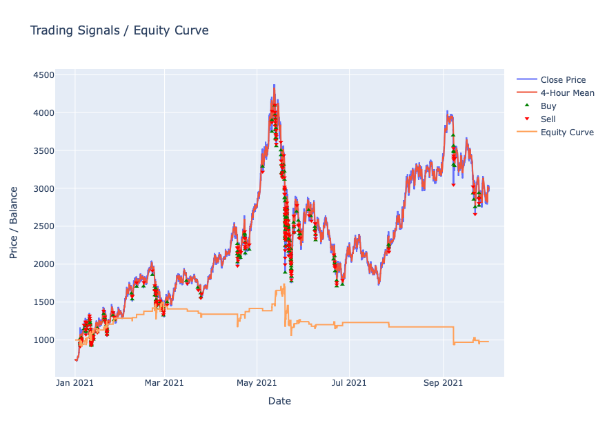

# Mean Reversion Trading Backtest

This project is an implementation of a backtest of a naive trading system using Python following [PEP 8 style](https://peps.python.org/pep-0008/).

This mean reversion backtest analyzes historical price data and executes trades based on deviations from the moving average. It also includes simple data analysis and cleaning before the processing and data visualization of the performance result.

## Installation

1. Clone the repository:

   ```bash
   git clone git@github.com:enbochen/mean-reversion-backtest.git
   cd mean-reversion-trading-strategy
   ```

1. Create a virtual environment (optional but recommended):

   ```bash
   python3 -m venv venv
   source venv/bin/activate
   ```

1. Install the required packages:

   ```bash
   pip install -r requirements.txt
   ```

1. run the backtest script:

   ```bash
   python src/main.py
   ```

1. run the tests:

   ```bash
   python tests/test_mean_reversion.py
   ```

## Backtest specs

- Assume that we're starting out with $1000.
- The market does not support margin trading, so we're only allowed to buy when we're not in a position.
- The system will enter the market when the price drops 4% below the 4-hour mean.
- A stoploss is set at 2% below the entry price.
- The system will sell at a profit if a target of 3% above the entry price is reached.
- The system will only ever open 1 position, so it has to close a position before entering a new one.
- The backtest may assume that market liquidity is always sufficient to complete trades at a current price, whenever desired.


## Result



The market in the question should be ETH based on the price history and volumn.

Performance:

```txt
Initial balance: $1000.00
Final balance: $979.35
Profit: $-20.65
Percentage profit: -2.06%
```



## Consideration for future improvements

- The close price is the used for calculating the mean for simpilicity even though the average of open, high, low, close data might provide a broader view of the volatile markets, where prices can fluctuate rapidly and unpredictably

- Trading fees/ gas fees is not considered in this impelementation but in reality it plays an important role especially in cryptocurrency.

- Performance is not the focus of this task, but it should be some kind of more efficient way than iteration loop(e.g vectorized calculation?)

- Looking forward to hearing feedbacks and more improvement ideas :)
